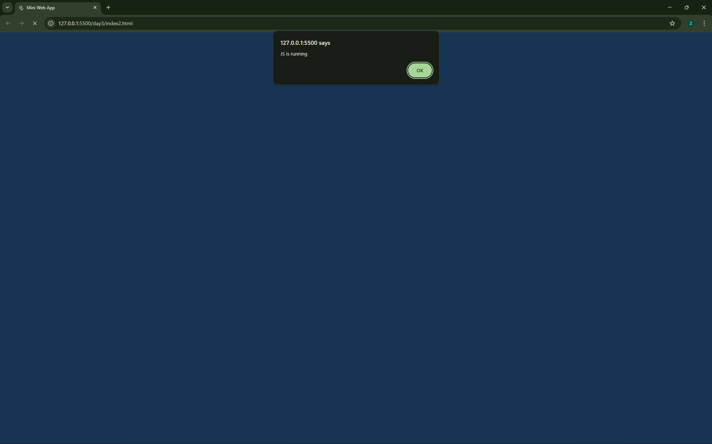
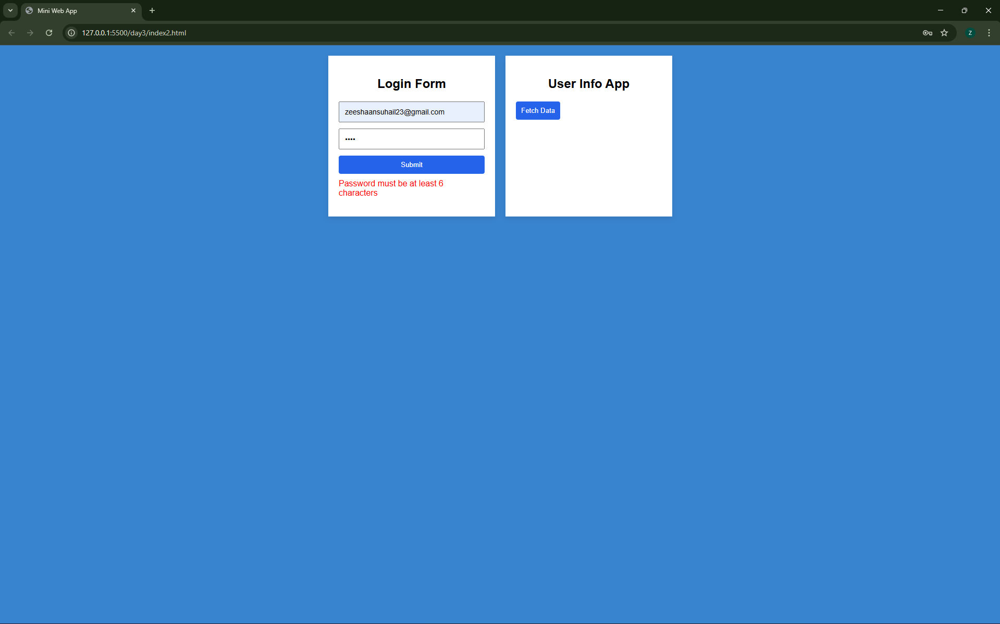
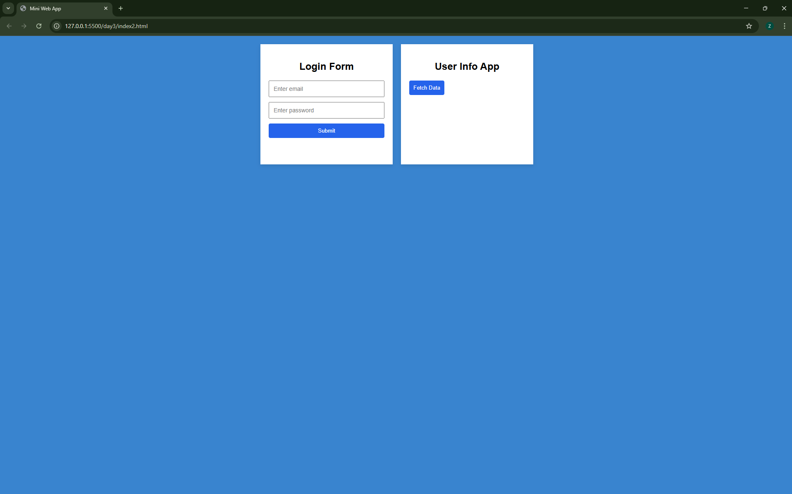
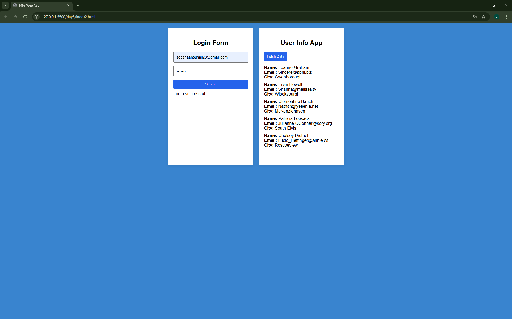

## Web App Fundamentals – Hackathon Prep

**WEEK 1**: 
This repo contains my daily progress while learning:

**Day 1**: HTML forms and inputs 
Built a complete HTML form using text, email, number, date, radio buttons, checkboxes, dropdowns, file upload, and specialized inputs such as phone, URL, color, and password. Implemented native form validation using required fields and input constraints. Connected the form to a results page to demonstrate an input to output flow by passing and displaying data via URL parameters. Practiced proper label associations and maintained clear, incremental Git commits. 
**Files:**

- [index.html](./index.html)
- [results.html](./results.html)

**Day 2**: CSS Flexbox, spacing, and responsive layout fundamentals 
Built a Flexbox based layout from scratch and progressively enhanced it through multiple iterations. Explored core Flexbox concepts including main axis and cross axis alignment, flex direction, wrapping behavior, gaps, and alignment overrides at both container and item levels. Practiced spacing using margin, padding, and gap with clear inline notes. Implemented responsive behavior using flex wrap and media queries to adapt layouts on smaller screens, reinforcing how layouts reflow dynamically. 
**Files:**

- [index1.html](./index1.html)
- [style1.css](./style1.css)

**Day 3**: Responsive design principles, DOM manipulation, events, and Fetch API 
Expanded responsive design understanding by breaking layouts into rows and columns and learning when to use Flexbox versus Grid. Documented key responsive concepts including media queries and positioning properties. Built a mini web app using JavaScript to handle DOM selection, event handling, and form validation without page reloads. Implemented a Fetch API based user info app that retrieves data from a public API, dynamically renders user details, and handles fetch errors gracefully. Combined HTML, CSS, and JavaScript into a clean, responsive input to process to output flow. 
**Files**:
- [index2.html](./index2.html)
- [Responsive-design.html](./Responsive-design.html)
- [style2.css](./style2.css)
- [script.js](./script.js)

*Mini Web App Preview* 
This mini web app demonstrates form validation, DOM manipulation, event handling, Fetch API usage, and responsive layout design using HTML, CSS, and JavaScript.

JavaScript Initialization
JS file is correctly loaded and executed on page load.

Login Form Validation
Client-side form validation prevents submission when the password length is less than 6 characters and displays inline error messages without reloading the page.

Successful Login Feedback
Displays success feedback dynamically once validation conditions are satisfied.

Fetch API User Info App
Fetches user data from a public API and dynamically renders user information on button click, with graceful error handling.

